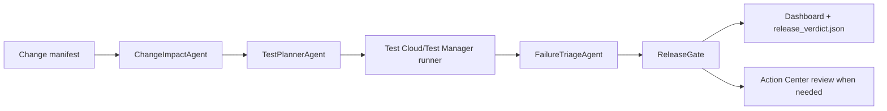

# Release Sentinel

Release Sentinel is a UiPath AgentHack Track 3 prototype for agentic release testing. It reviews a proposed software or automation change, predicts release risk, selects the right UiPath Test Cloud tests, triages failures, and produces an evidence-backed release verdict.

The demo scenario uses a synthetic insurance workflow called ClaimsPilot. A change to eligibility and claim routing is analyzed by the agent, mapped to Test Manager coverage, executed through a local deterministic runner or UiPath Test Manager, and summarized in a dashboard built for the hackathon video.

## Why This Fits Track 3

- Reimagines test planning and release gating with agents.
- Uses Test Cloud/Test Manager as the execution and evidence system.
- Creates real Action Center review tasks for ambiguous or low-confidence results when Orchestrator credentials are configured.
- Shows coding-agent usage and a clear handoff to UiPath Automation Cloud.
- Uses only synthetic data, so the repo can be public.

## Architecture



Core modules:

- `src/claimspilot`: the small enterprise workflow under test.
- `src/releasesentinel/agents.py`: risk scoring, test planning, triage, and release gate logic.
- `src/releasesentinel/runners.py`: local deterministic runner plus a thin `uip tm` adapter.
- `src/releasesentinel/action_center.py`: real Action Center form task creation with safe local fallback.
- `src/releasesentinel/coverage_sync.py`: live Test Manager test-set sync via `uip tm testsets list`.
- `src/releasesentinel/flakiness.py`: historical flakiness scoring from Test Manager execution logs.
- `src/releasesentinel/api.py`: API Workflow-friendly HTTP endpoints.
- `src/releasesentinel/io.py`: verdict persistence plus compact JSONL run history.
- `web/templates/dashboard.html`: a local evidence dashboard with one-click demo scenarios and live polling.

## Agent Type

Release Sentinel utilizes **Coded Agents** built with Python and Pydantic models to implement custom agent logic (risk analysis, test selection, execution triage, and release gating). These coded agent capabilities are designed to be exposed as API Workflow endpoints or packaged as local tools.


## Prerequisites

- **Python**: version 3.11 or higher.
- **Node.js & npm** (optional): required only if running the real Test Cloud integration via the UiPath CLI `@uipath/cli`.
- **UiPath Automation Cloud Tenant** (optional): required for cloud execution and UiPath Test Manager integration.

## Quickstart

### 5-Minute Local Demo

```bash
# 1. Install
make install

# 2. Run a test scenario
python -m releasesentinel run --scenario failing --pretty

# 3. Start dashboard server
python -m releasesentinel serve --port 8000

# 4. Open browser
open http://127.0.0.1:8000/dashboard
```

The dashboard shows release verdict, risk drivers, selected tests, execution evidence, and one-click scenario controls.

### Using Make Targets

```bash
make test              # Run 22 tests
make lint              # Check code quality
make format            # Auto-format code
make check             # All quality gates
make docker-build      # Build Docker image
make docker-up         # Start Docker container
make help              # View all tasks
```

Use these scenarios for the demo:

```bash
python -m releasesentinel run --manifest data/fixtures/low_risk_manifest.json --scenario happy --pretty
python -m releasesentinel run --scenario failing --pretty
python -m releasesentinel run --manifest data/fixtures/ambiguous_manifest.json --scenario ambiguous --pretty
python -m releasesentinel run --scenario timeout --pretty
```

### Deployment

Deploy with Docker:

```bash
make docker-build
make docker-up
```

Or run on UiPath cloud:

```bash
export RELEASE_SENTINEL_RUNNER='uipath'
python -m releasesentinel run --scenario failing --pretty --runner uipath --sync-coverage
```

See [docs/DEPLOYMENT.md](docs/DEPLOYMENT.md) for detailed setup and troubleshooting.

Optional cloud-review variables:

```powershell
$env:RELEASE_SENTINEL_ORCHESTRATOR_URL='https://cloud.uipath.com/org/tenant/orchestrator_'
$env:RELEASE_SENTINEL_ORCHESTRATOR_TOKEN='<bearer-token>'
$env:RELEASE_SENTINEL_TASK_CATALOG='ReleaseGateReviews'
$env:RELEASE_SENTINEL_FLAKINESS_THRESHOLD='0.35'
```

## Troubleshooting

**Tests fail with import errors?**

```bash
python -m pip install -e ".[dev]"
```

**Dashboard shows "No verdict generated"?**

Generate one first:

```bash
python -m releasesentinel run --scenario happy --pretty
```

**UiPath CLI not found?**

Install globally:

```bash
npm install -g @uipath/cli
```

See [docs/DEPLOYMENT.md](docs/DEPLOYMENT.md#troubleshooting) for more help.

## API Contracts

The API is designed so UiPath API Workflows or Agent Builder tools can call deterministic functions.

- `POST /api/analyze-change`
- `POST /api/select-tests`
- `POST /api/triage-results`
- `POST /api/release-verdict`
- `POST /api/demo-run`
- `GET /api/latest-verdict`
- `GET /api/run-history`

Input/output files:

- `data/change_manifest.json`: changed files, requirement text, affected capabilities, risk tags.
- `data/coverage_map.json`: capability-to-testset and testcase mapping.
- `artifacts/release_verdict.json`: risk score, selected tests, execution evidence, triage, decision, human-review state.
- `artifacts/run_history.jsonl`: compact local audit trail used by the live dashboard.

## UiPath Components

The intended Automation Cloud implementation uses:

- UiPath Test Cloud/Test Manager for test cases, test sets, executions, reports, and attachments.
- UiPath CLI `uip tm` for CI-style launch, wait, report, and result collection.
- UiPath for Coding Agents with Codex skills installed locally.
- UiPath Agent Builder or coded agent deployment for Release Sentinel orchestration.
- API Workflows as governed tools for analysis, selection, triage, and verdict publishing.
- Action Center for real human review tasks when failures are ambiguous, timed out, critical-risk, or low-confidence.

The repository keeps a local simulator for development, but the submission demo should use UiPath Test Manager by setting `RELEASE_SENTINEL_RUNNER=uipath` and running with `--sync-coverage` in the UiPath Labs environment.

See [docs/UIPATH_SETUP.md](docs/UIPATH_SETUP.md) for the Test Cloud wiring plan.

## Coding Agents Bonus (AI-Assisted Development)

This project qualifies for the hackathon bonus points under the Platform Usage criterion by utilizing coding agents:
- **Coding Agent Used**: Built using **Gemini CLI / Antigravity** agentic AI coding assistant and **UiPath for Coding Agents** interfaces.
- **Contribution**: The coding agent assisted in building the python coded pipeline (scoring engine, planners, and triage agents), setting up the FastAPI REST services, implementing the responsive dark/light mode dashboard interface, and troubleshooting Windows-specific command execution shim issues for globally installed npm packages.
- **Integration**: The agentic code output forms the core execution pipeline, tests, and web assets of Release Sentinel.


## Demo Flow

1. Show `change_manifest.json` for the ClaimsPilot eligibility/routing change.
2. Run Release Sentinel and show the risk drivers.
3. Show selected Test Cloud suites and execution IDs.
4. Show failure triage: product bug, test fragility, data issue, timeout, or needs human review.
5. Use the dashboard buttons to switch between approve, block, review, and timeout outcomes.
6. Show the dashboard verdict, run history, and Action Center handoff for ambiguous cases.

## Troubleshooting

### Common Issues

#### Tests fail with "ModuleNotFoundError"

```bash
export PYTEST_DISABLE_PLUGIN_AUTOLOAD='1'
python -m pytest -v
```

Ensure you've installed with dev dependencies: `pip install -e ".[dev]"`

#### Dashboard won't load (blank page)

1. Verify the server is running:
   ```bash
   curl http://localhost:8000/
   ```

2. Check browser console for JavaScript errors

3. Ensure you've generated a verdict first:
   ```bash
   python -m releasesentinel run --scenario happy --pretty
   python -m releasesentinel serve --port 8000
   ```

#### Docker container exits immediately

```bash
# Check the logs
docker logs <container-id>

# Ensure Dockerfile and pyproject.toml are in sync
docker build --no-cache -t release-sentinel:latest .
docker run -it release-sentinel:latest python -m releasesentinel --help
```

#### UiPath runner fails

- Verify credentials: `uip login status`
- Check folder key: `uip tm testsets list --project-key REL_SENTINEL`
- Ensure network connectivity to UiPath cloud
- Set environment variables correctly (no typos in `RELEASE_SENTINEL_RUNNER=uipath`)

#### Port 8000 already in use

```bash
# Use a different port
python -m releasesentinel serve --port 9000

# Or find and kill the process
lsof -i :8000
kill -9 <PID>
```

### Performance Issues

#### High memory usage in Docker

Set memory limits:

```bash
docker run -m 512m release-sentinel:latest
```

Or in `docker-compose.yml`:

```yaml
services:
  release-sentinel:
    mem_limit: 512m
```

#### Slow test execution

- Verify Test Manager connectivity isn't the bottleneck
- Run locally first: `RELEASE_SENTINEL_RUNNER=local python -m releasesentinel run`
- Check resource availability: `docker stats`

### Need More Help?

- 📖 **[Full Deployment Guide](DEPLOYMENT.md)** - Comprehensive deployment & troubleshooting
- 🏗️ **[Architecture Guide](docs/ARCHITECTURE.md)** - Understanding the system design
- 🔧 **[UiPath Setup](docs/UIPATH_SETUP.md)** - Cloud integration troubleshooting
- 💬 **[GitHub Issues](https://github.com/Ibrahimboutal/Release-Sentinel/issues)** - Ask the community

---

## API Documentation

Once the server is running, view interactive API documentation:

- **Swagger UI**: http://127.0.0.1:8000/docs
- **ReDoc**: http://127.0.0.1:8000/redoc
- **OpenAPI JSON**: http://127.0.0.1:8000/openapi.json

### Example: Analyze a Change

```bash
curl -X POST "http://127.0.0.1:8000/api/analyze-change" \
  -H "Content-Type: application/json" \
  -d '{
    "manifest": {
      "title": "Eligibility routing fix",
      "requirement": "Update claim eligibility logic",
      "changed_files": ["src/claimspilot/eligibility.py"],
      "risk_tags": ["customer_impact", "regulated_decision"],
      "capabilities": ["eligibility", "routing"]
    }
  }'
```

---

## Environment Variables

### Development

```bash
# Run with local simulator (default)
export RELEASE_SENTINEL_RUNNER='local'

# Verbosity
export LOG_LEVEL='DEBUG'
```

### Production (UiPath Cloud)

```bash
# Switch to UiPath Test Manager runner
export RELEASE_SENTINEL_RUNNER='uipath'

# Orchestrator credentials
export RELEASE_SENTINEL_ORCHESTRATOR_URL='https://cloud.uipath.com/org/tenant/orchestrator_'
export RELEASE_SENTINEL_ORCHESTRATOR_TOKEN='<your-bearer-token>'

# Test Manager folder (optional, filters coverage sync)
export RELEASE_SENTINEL_TEST_MANAGER_FOLDER_KEY='<folder-uuid>'

# Action Center for human review
export RELEASE_SENTINEL_TASK_CATALOG='ReleaseGateReviews'

# Flakiness scoring threshold (0.0-1.0)
export RELEASE_SENTINEL_FLAKINESS_THRESHOLD='0.35'
```

See [DEPLOYMENT.md](DEPLOYMENT.md#environment-configuration) for complete reference.

## Contributing


Want to improve Release Sentinel? See [CONTRIBUTING.md](CONTRIBUTING.md) for:
- Development setup
- Testing guidelines  
- Code quality standards
- PR submission process

## License

MIT. Synthetic ClaimsPilot data and examples are included for public hackathon evaluation.

## FAQ

### General Questions

**Q: What's the difference between Release Sentinel and traditional test automation?**

A: Traditional automation runs all tests uniformly. Release Sentinel uses risk analysis to choose the right test scope, then explains why those tests were selected and what failures mean. It also routes ambiguous cases to humans instead of making uninformed decisions.

**Q: Can I use Release Sentinel with non-UiPath systems?**

A: Yes! The local simulator mode (`RELEASE_SENTINEL_RUNNER=local`) runs entirely without UiPath. Cloud integration requires UiPath Test Manager, but the core agents and risk scoring work anywhere.

**Q: Is Release Sentinel production-ready?**

A: This is a hackathon prototype. The core agent logic and risk scoring are solid, but consider this a reference implementation. Production use requires:
- Integration testing in your environment
- Credential and secret management setup
- Test Manager project configuration
- CI/CD pipeline integration
- Monitoring and alerting

**Q: How long does a release gate decision take?**

A: Depends on your test scope. Smoke tests (low risk) might take 2-5 minutes. Targeted regression (medium risk) could be 10-30 minutes. Full regression (critical risk) might be 30+ minutes. Local mode is instant (simulated).

### Technical Questions

**Q: How does risk scoring work?**

A: The `ChangeImpactAgent` reads your change manifest and scores risk based on:
- Requirement keywords (eligibility, routing, payment, security, compliance increase risk)
- Changed file paths (tests decrease risk, core logic increases it)
- Risk tags you assign (customer_impact, regulated_decision add risk)
- Affected capabilities from coverage mapping

See `src/releasesentinel/agents.py` for the scoring tables.

**Q: How are failures triaged?**

A: The `FailureTriageAgent` classifies failures as:
- **Product bug** - Likely real issue in the code
- **Test fragility** - Flaky UI selector or timing issue
- **Data issue** - Test data is stale or missing
- **Environment issue** - Infrastructure problem
- **Needs human review** - Ambiguous and should go to Action Center

Triage improves when you provide historical flakiness data from Test Manager.

**Q: Can I customize the risk scoring?**

A: Yes! Edit the risk weights in `src/releasesentinel/agents.py`:
- `HIGH_RISK_TERMS` - Keywords that increase risk
- `FILE_RISK_RULES` - File patterns that affect risk
- `TAG_RISK_RULES` - Risk tag multipliers

Then rebuild and redeploy.

**Q: How do I integrate with my CI/CD pipeline?**

A: Use the FastAPI endpoints or CLI:

```bash
# In your GitHub Actions, GitLab CI, or Jenkins:
python -m releasesentinel run --manifest <path> --runner uipath --pretty

# Or call via API:
curl -X POST http://release-sentinel/api/release-verdict \
  -H "Content-Type: application/json" \
  -d @change_manifest.json
```

### Deployment Questions

**Q: Should I run Release Sentinel in Docker or locally?**

A: For production:
- **Docker**: Recommended. Use `docker-compose up` or deploy to Kubernetes/ECS/Cloud Run
- **Local**: Development only

For quick testing:
- **Local**: Easier to debug and iterate
- **Docker**: Better matches production environment

**Q: Can I use Release Sentinel with GitHub Actions?**

A: Yes! The CI workflow in `.github/workflows/ci.yml` runs tests automatically. To add Release Sentinel as a gate:

```yaml
- name: Run release gate
  run: |
    python -m pip install -e .
    python -m releasesentinel run --manifest change_manifest.json --pretty
```

**Q: How do I secure my Orchestrator credentials?**

A: Never commit tokens. Use:
- GitHub Actions secrets: `${{ secrets.ORCHESTRATOR_TOKEN }}`
- Docker secrets or ConfigMaps in Kubernetes
- Environment variables in CI/CD
- Secret managers (AWS Secrets Manager, HashiCorp Vault)

**Q: Can I run Release Sentinel on-premises?**

A: Yes! The local mode runs entirely on-premises. For cloud integration, you'll need network access to UiPath Automation Cloud, but Release Sentinel itself can run anywhere Python 3.11+ is available.

### Troubleshooting Questions

**Q: Tests pass locally but fail in CI**

A: Common causes:
1. `PYTEST_DISABLE_PLUGIN_AUTOLOAD='1'` not set in CI
2. Python version mismatch (check `.github/workflows/ci.yml`)
3. Missing environment variables
4. Mock/fixture not set up correctly in CI environment

**Q: Dashboard shows "No verdicts generated yet"**

A: Run a scenario first:
```bash
python -m releasesentinel run --scenario happy --pretty
python -m releasesentinel serve --port 8000
```

Then refresh the dashboard at http://localhost:8000/dashboard.

**Q: UiPath integration hangs**

A: Check:
1. Network connectivity to cloud.uipath.com
2. Token expiration: `uip refresh`
3. Test Manager folder exists and is accessible
4. No firewall blocking HTTPS to UiPath cloud

Set shorter timeouts in production:
```bash
export RELEASE_SENTINEL_RUNNER_TIMEOUT=300  # 5 minutes
```

**Q: How do I debug agent decisions?**

A: Run with verbose output:
```bash
python -m releasesentinel run --scenario failing --pretty
```

The output shows:
- Risk drivers and score
- Selected test sets and why
- Failure triage reasoning
- Final verdict and justification

**Q: Coverage sync returns no tests**

A: Verify:
1. UiPath CLI is installed: `uip --version`
2. You're logged in: `uip login status`
3. Test Manager project exists with correct key
4. Folder key is correct (if filtering by folder)

### Contributing Questions

**Q: How do I contribute?**

A: See [CONTRIBUTING.md](CONTRIBUTING.md) for:
- Development setup
- Code style guidelines
- Testing requirements
- PR submission process

**Q: Can I add new agents?**

A: Yes! Create a new agent class in `src/releasesentinel/agents.py`, define input/output models in `models.py`, add tests, and wire into `pipeline.py`. See CONTRIBUTING.md for an example.

**Q: How do I report bugs?**

A: Open a GitHub issue with:
1. Clear title
2. Steps to reproduce
3. Expected vs actual behavior
4. Your environment (OS, Python version, how you're running it)
5. Relevant logs or screenshots

---

Still have questions? Check the [Documentation](docs/) folder or open an issue!
