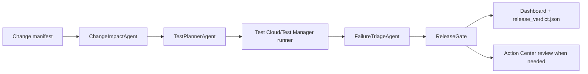

# Release Sentinel

Release Sentinel is a UiPath AgentHack Track 3 prototype for agentic release testing. It reviews a proposed software or automation change, predicts release risk, selects the right UiPath Test Cloud tests, triages failures, and produces an evidence-backed release verdict.

The demo scenario uses a synthetic insurance workflow called ClaimsPilot. A change to eligibility and claim routing is analyzed by the agent, mapped to Test Manager coverage, executed through a local deterministic runner or UiPath Test Manager, and summarized in a dashboard built for the hackathon video.

## Why This Fits Track 3

- Reimagines test planning and release gating with agents.
- Uses Test Cloud/Test Manager as the execution and evidence system.
- Keeps humans in the loop for ambiguous or low-confidence results.
- Shows coding-agent usage and a clear handoff to UiPath Automation Cloud.
- Uses only synthetic data, so the repo can be public.

## Architecture



Core modules:

- `src/claimspilot`: the small enterprise workflow under test.
- `src/releasesentinel/agents.py`: risk scoring, test planning, triage, and release gate logic.
- `src/releasesentinel/runners.py`: local deterministic runner plus a thin `uip tm` adapter.
- `src/releasesentinel/api.py`: API Workflow-friendly HTTP endpoints.
- `web/templates/dashboard.html`: a local evidence dashboard for the demo.

## Agent Type

Release Sentinel utilizes **Coded Agents** built with Python and Pydantic models to implement custom agent logic (risk analysis, test selection, execution triage, and release gating). These coded agent capabilities are designed to be exposed as API Workflow endpoints or packaged as local tools.


## Prerequisites

- **Python**: version 3.11 or higher.
- **Node.js & npm** (optional): required only if running the real Test Cloud integration via the UiPath CLI `@uipath/cli`.
- **UiPath Automation Cloud Tenant** (optional): required for cloud execution and UiPath Test Manager integration.

## Quickstart


```powershell
python -m pip install -e ".[dev]"
$env:PYTEST_DISABLE_PLUGIN_AUTOLOAD='1'; python -m pytest
python -m releasesentinel run --scenario failing --pretty
python -m releasesentinel serve --port 8000
```

Open `http://127.0.0.1:8000/dashboard` after generating a verdict.

`PYTEST_DISABLE_PLUGIN_AUTOLOAD` keeps unrelated machine-level pytest plugins from loading into the project test run.

Use these scenarios for the demo:

```powershell
python -m releasesentinel run --manifest data/fixtures/low_risk_manifest.json --scenario happy --pretty
python -m releasesentinel run --scenario failing --pretty
python -m releasesentinel run --manifest data/fixtures/ambiguous_manifest.json --scenario ambiguous --pretty
python -m releasesentinel run --scenario timeout --pretty
```

For the hackathon submission, use the UiPath-backed runner with a real Test Manager folder key configured in UiPath Labs:

```powershell
$env:RELEASE_SENTINEL_RUNNER='uipath'
python -m releasesentinel run --scenario failing --pretty --runner uipath
```

## API Contracts

The API is designed so UiPath API Workflows or Agent Builder tools can call deterministic functions.

- `POST /api/analyze-change`
- `POST /api/select-tests`
- `POST /api/triage-results`
- `POST /api/release-verdict`
- `GET /api/latest-verdict`

Input/output files:

- `data/change_manifest.json`: changed files, requirement text, affected capabilities, risk tags.
- `data/coverage_map.json`: capability-to-testset and testcase mapping.
- `artifacts/release_verdict.json`: risk score, selected tests, execution evidence, triage, decision, human-review state.

## UiPath Components

The intended Automation Cloud implementation uses:

- UiPath Test Cloud/Test Manager for test cases, test sets, executions, reports, and attachments.
- UiPath CLI `uip tm` for CI-style launch, wait, report, and result collection.
- UiPath for Coding Agents with Codex skills installed locally.
- UiPath Agent Builder or coded agent deployment for Release Sentinel orchestration.
- API Workflows as governed tools for analysis, selection, triage, and verdict publishing.
- Action Center for human review when failures are ambiguous, timed out, or low-confidence.

The repository keeps a local simulator for development, but the submission demo should use UiPath Test Manager by setting `RELEASE_SENTINEL_RUNNER=uipath` and `RELEASE_SENTINEL_TEST_MANAGER_FOLDER_KEY` in the UiPath Labs environment.

See [docs/UIPATH_SETUP.md](docs/UIPATH_SETUP.md) for the Test Cloud wiring plan.

## Coding Agents Bonus (AI-Assisted Development)

This project qualifies for the hackathon bonus points under the Platform Usage criterion by utilizing coding agents:
- **Coding Agent Used**: Built using **Gemini CLI / Antigravity** agentic AI coding assistant and **UiPath for Coding Agents** interfaces.
- **Contribution**: The coding agent assisted in building the python coded pipeline (scoring engine, planners, and triage agents), setting up the FastAPI REST services, implementing the responsive dark/light mode dashboard interface, and troubleshooting Windows-specific command execution shim issues for globally installed npm packages.
- **Integration**: The agentic code output forms the core execution pipeline, tests, and web assets of Release Sentinel.


## Demo Flow

1. Show `change_manifest.json` for the ClaimsPilot eligibility/routing change.
2. Run Release Sentinel and show the risk drivers.
3. Show selected Test Cloud suites and execution IDs.
4. Show failure triage: product bug, test fragility, data issue, timeout, or needs human review.
5. Show the dashboard verdict and the Action Center handoff for ambiguous cases.

## Submission Assets

- Devpost copy: [submission/devpost.md](submission/devpost.md)
- Video script: [submission/demo-video-script.md](submission/demo-video-script.md)
- Presentation outline: [submission/presentation-outline.md](submission/presentation-outline.md)
- Editable PowerPoint deck: [release-sentinel-agenthack.pptx](outputs/manual-release-sentinel/presentations/release-sentinel/output/release-sentinel-agenthack.pptx)
- UiPath setup: [docs/UIPATH_SETUP.md](docs/UIPATH_SETUP.md)

## License

MIT. Synthetic ClaimsPilot data and examples are included for public hackathon evaluation.
