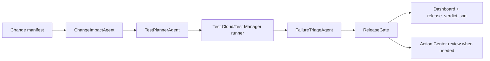

# Release Sentinel

Release Sentinel is a UiPath AgentHack Track 3 prototype for agentic release testing. It reviews a proposed software or automation change, predicts release risk, selects the right UiPath Test Cloud tests, triages failures, and produces an evidence-backed release verdict.

The demo scenario uses a synthetic insurance workflow called ClaimsPilot. A change to eligibility and claim routing is analyzed by the agent, mapped to Test Manager coverage, executed through a local deterministic runner or UiPath Test Manager, and summarized in a dashboard built for the hackathon video.

## Why This Fits Track 3

- Reimagines test planning and release gating with agents.
- Uses Test Cloud/Test Manager as the execution and evidence system.
- Creates real Action Center review tasks for ambiguous or low-confidence results when Orchestrator credentials are configured.
- Shows coding-agent usage and a clear handoff to UiPath Automation Cloud.
- Uses only synthetic data, so the repo can be public.

## Architecture



Core modules:

- `src/claimspilot`: the small enterprise workflow under test.
- `src/releasesentinel/agents.py`: risk scoring, test planning, triage, and release gate logic.
- `src/releasesentinel/runners.py`: local deterministic runner plus a thin `uip tm` adapter.
- `src/releasesentinel/action_center.py`: real Action Center form task creation with safe local fallback.
- `src/releasesentinel/coverage_sync.py`: live Test Manager test-set sync via `uip tm testsets list`.
- `src/releasesentinel/flakiness.py`: historical flakiness scoring from Test Manager execution logs.
- `src/releasesentinel/api.py`: API Workflow-friendly HTTP endpoints.
- `src/releasesentinel/io.py`: verdict persistence plus compact JSONL run history.
- `web/templates/dashboard.html`: a local evidence dashboard with one-click demo scenarios and live polling.

## Agent Type

Release Sentinel utilizes **Coded Agents** built with Python and Pydantic models to implement custom agent logic (risk analysis, test selection, execution triage, and release gating). These coded agent capabilities are designed to be exposed as API Workflow endpoints or packaged as local tools.


## Prerequisites

- **Python**: version 3.11 or higher.
- **Node.js & npm** (optional): required only if running the real Test Cloud integration via the UiPath CLI `@uipath/cli`.
- **UiPath Automation Cloud Tenant** (optional): required for cloud execution and UiPath Test Manager integration.

## Quickstart

### 5-Minute Local Demo

```bash
# 1. Install
make install

# 2. Run a test scenario
python -m releasesentinel run --scenario failing --pretty

# 3. Start dashboard server
python -m releasesentinel serve --port 8000

# 4. Open browser
open http://127.0.0.1:8000/dashboard
```

The dashboard shows release verdict, risk drivers, selected tests, execution evidence, and one-click scenario controls.

### Using Make Targets

```bash
make test              # Run 22 tests
make lint              # Check code quality
make format            # Auto-format code
make check             # All quality gates
make docker-build      # Build Docker image
make docker-up         # Start Docker container
make help              # View all tasks
```

Use these scenarios for the demo:

```bash
python -m releasesentinel run --manifest data/fixtures/low_risk_manifest.json --scenario happy --pretty
python -m releasesentinel run --scenario failing --pretty
python -m releasesentinel run --manifest data/fixtures/ambiguous_manifest.json --scenario ambiguous --pretty
python -m releasesentinel run --scenario timeout --pretty
```

### Deployment

Deploy with Docker:

```bash
make docker-build
make docker-up
```

Or run on UiPath cloud:

```bash
export RELEASE_SENTINEL_RUNNER='uipath'
python -m releasesentinel run --scenario failing --pretty --runner uipath --sync-coverage
```

See [docs/DEPLOYMENT.md](docs/DEPLOYMENT.md) for detailed setup and troubleshooting.

Optional cloud-review variables:

```powershell
$env:RELEASE_SENTINEL_ORCHESTRATOR_URL='https://cloud.uipath.com/org/tenant/orchestrator_'
$env:RELEASE_SENTINEL_ORCHESTRATOR_TOKEN='<bearer-token>'
$env:RELEASE_SENTINEL_TASK_CATALOG='ReleaseGateReviews'
$env:RELEASE_SENTINEL_FLAKINESS_THRESHOLD='0.35'
```

## Troubleshooting

**Tests fail with import errors?**

```bash
python -m pip install -e ".[dev]"
```

**Dashboard shows "No verdict generated"?**

Generate one first:

```bash
python -m releasesentinel run --scenario happy --pretty
```

**UiPath CLI not found?**

Install globally:

```bash
npm install -g @uipath/cli
```

See [docs/DEPLOYMENT.md](docs/DEPLOYMENT.md#troubleshooting) for more help.

## API Contracts

The API is designed so UiPath API Workflows or Agent Builder tools can call deterministic functions.

- `POST /api/analyze-change`
- `POST /api/select-tests`
- `POST /api/triage-results`
- `POST /api/release-verdict`
- `POST /api/demo-run`
- `GET /api/latest-verdict`
- `GET /api/run-history`

Input/output files:

- `data/change_manifest.json`: changed files, requirement text, affected capabilities, risk tags.
- `data/coverage_map.json`: capability-to-testset and testcase mapping.
- `artifacts/release_verdict.json`: risk score, selected tests, execution evidence, triage, decision, human-review state.
- `artifacts/run_history.jsonl`: compact local audit trail used by the live dashboard.

## UiPath Components

The intended Automation Cloud implementation uses:

- UiPath Test Cloud/Test Manager for test cases, test sets, executions, reports, and attachments.
- UiPath CLI `uip tm` for CI-style launch, wait, report, and result collection.
- UiPath for Coding Agents with Codex skills installed locally.
- UiPath Agent Builder or coded agent deployment for Release Sentinel orchestration.
- API Workflows as governed tools for analysis, selection, triage, and verdict publishing.
- Action Center for real human review tasks when failures are ambiguous, timed out, critical-risk, or low-confidence.

The repository keeps a local simulator for development, but the submission demo should use UiPath Test Manager by setting `RELEASE_SENTINEL_RUNNER=uipath` and running with `--sync-coverage` in the UiPath Labs environment.

See [docs/UIPATH_SETUP.md](docs/UIPATH_SETUP.md) for the Test Cloud wiring plan.

## Coding Agents Bonus (AI-Assisted Development)

This project qualifies for the hackathon bonus points under the Platform Usage criterion by utilizing coding agents:
- **Coding Agent Used**: Built using **Gemini CLI / Antigravity** agentic AI coding assistant and **UiPath for Coding Agents** interfaces.
- **Contribution**: The coding agent assisted in building the python coded pipeline (scoring engine, planners, and triage agents), setting up the FastAPI REST services, implementing the responsive dark/light mode dashboard interface, and troubleshooting Windows-specific command execution shim issues for globally installed npm packages.
- **Integration**: The agentic code output forms the core execution pipeline, tests, and web assets of Release Sentinel.


## Demo Flow

1. Show `change_manifest.json` for the ClaimsPilot eligibility/routing change.
2. Run Release Sentinel and show the risk drivers.
3. Show selected Test Cloud suites and execution IDs.
4. Show failure triage: product bug, test fragility, data issue, timeout, or needs human review.
5. Use the dashboard buttons to switch between approve, block, review, and timeout outcomes.
6. Show the dashboard verdict, run history, and Action Center handoff for ambiguous cases.

## Submission Assets

- Devpost copy: [submission/devpost.md](submission/devpost.md)
- Video script: [submission/demo-video-script.md](submission/demo-video-script.md)
- Presentation outline: [submission/presentation-outline.md](submission/presentation-outline.md)
- Editable PowerPoint deck: [release-sentinel-agenthack.pptx](outputs/manual-release-sentinel/presentations/release-sentinel/output/release-sentinel-agenthack.pptx)
- UiPath setup: [docs/UIPATH_SETUP.md](docs/UIPATH_SETUP.md)

## Contributing

Want to improve Release Sentinel? See [CONTRIBUTING.md](CONTRIBUTING.md) for:
- Development setup
- Testing guidelines  
- Code quality standards
- PR submission process

## License

MIT. Synthetic ClaimsPilot data and examples are included for public hackathon evaluation.
